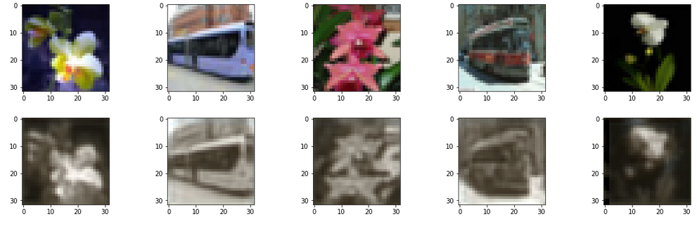
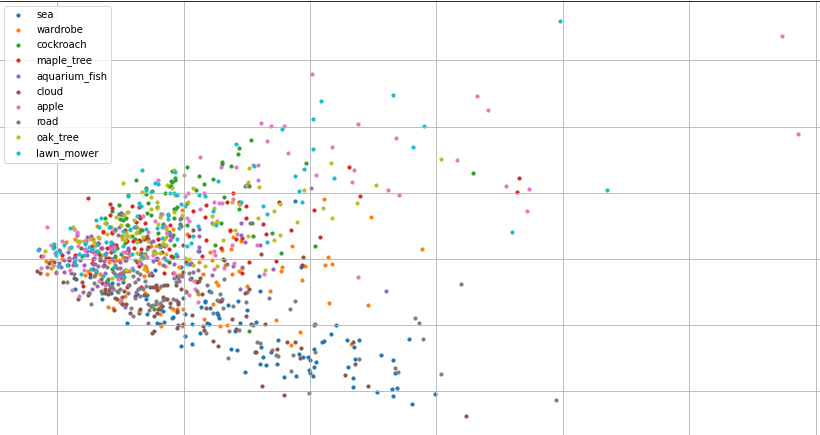

# Тестовое задание
## Подготовка датасета
В качестве датасета был выбран CIFAR100, и подготовлен класс для работы с [ним](dataset.py):
```
class Cifar100(Dataset):  
    def __init__(self, root='CIFAR100/TRAIN'):  
        self.root = root  
        self.list_of_data = []  
  
        for root, _, files in os.walk(self.root):  
            for file in files:  
                self.list_of_data.append(os.path.join(root.split('/')[-1], file))  
  
        self.classes = os.listdir(self.root)  
  
    def __len__(self):  
        return len(self.list_of_data)  
  
    def __getitem__(self, item):  
        path = self.list_of_data[item]  
        label = path.split('/')[0]  
        label = self.classes.index(label)  
  
        img = cv2.imread(os.path.join(self.root, path))  
        img = cv2.cvtColor(img, cv2.COLOR_BGR2RGB)  
  
        img = img.transpose(-1, 0, 1)  # from numpy to torch image  
  
 return img, label
```

## Модель автоенкодера
Сделана простая модель [автоенкодера](model.py). Тренировал 250 эпох, до такого результата:


## Модель Классификатора
Модель классифицирует объекты после енкодера. 

|top 3 | top 5 | top 10 |
--- | --- | ---
|0.2429|0.3141 |0.4395|



## 


