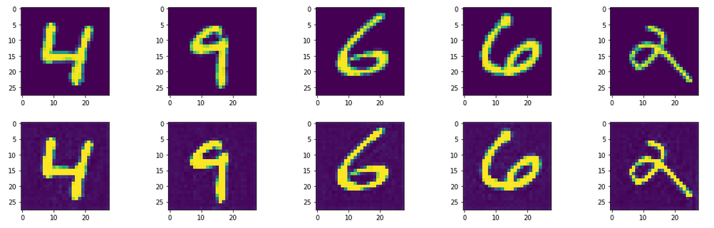
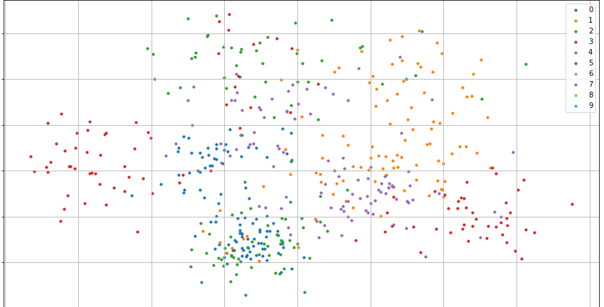

# Тестовое задание
## Подготовка датасета

Из-за неудачного подбора моеделей перешёл на MNIST

```
class Mnist(Dataset):  
    def __init__(self, images='train-images.idx3-ubyte', labels="train-labels.idx1-ubyte"):  
  
        with open(labels, 'rb') as fimg:  
            magic_nr, _ = struct.unpack(">II", fimg.read(8))  
            lbl = array("b", fimg.read())  
  
        with open(images, 'rb') as fimg:  
            magic_nr, size, rows, cols = struct.unpack(">IIII", fimg.read(16))  
            img = array("B", fimg.read())  
  
        ind = [k for k in range(size) if lbl[k] in np.arange(10)]  
  
        images = np.zeros((size, rows, cols), dtype=np.uint8)  
        labels = np.zeros((size, 1), dtype=np.int8)  
  
        for i in range(size):  
            images[i] = np.array(img[ind[i] * rows * cols: (ind[i] + 1) * rows * cols]).reshape((rows, cols))  
            labels[i] = lbl[ind[i]]  
  
        self.images = images  
        self.labels = labels.squeeze()  
  
    def __len__(self):  
        return len(self.labels)  
  
    def __getitem__(self, item):  
  
        img = self.images[item].reshape(1, 28, 28)  
        label = self.labels[item]  
  
        return img, label
```

## Модель автоенкодера

Тренировал модель Unet, получил такой результат:


## Модель Классификатора
Модель классифицирует объекты на скрытом слое Unet 
Качество модели на Unet:

|top 1 | top 3 | top 5 |
--- | --- | ---
|0.97|0.98 |1|

Распределение классов на Mnist на скрытом пространстве из Unet



